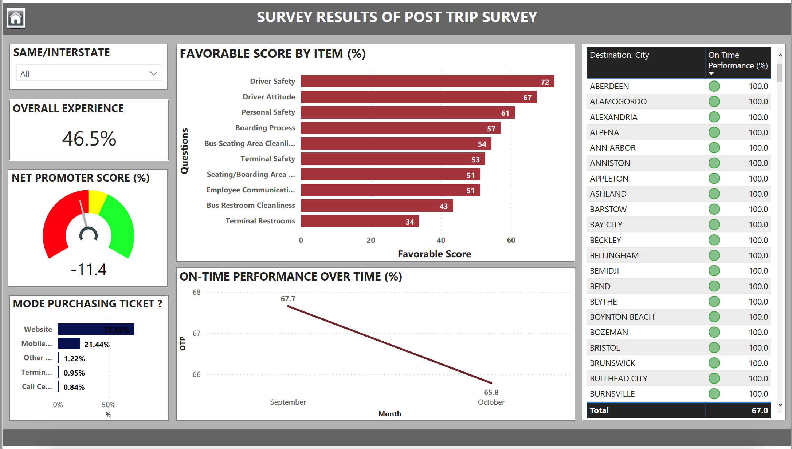

# Post Trip Survey
This repository presents data insights/analytics for post trip survey data in USA. This survey analysis was majorly based on below two key metrics.

### Metrics Used:
- **Likert Scale** - Likert scaling is a bipolar scaling method, measuring either positive or negative response to a statement.
- **Net Promoter Score (NPS)** - Net Promoter or Net Promoter Score (NPS) is the percentage of customers rating their likelihood to recommend a company, a product, or a service to a friend or colleague as 9 or 10 ("Promoters") minus the percentage rating this at 6 or below ("Detractors") on a scale from 0 to 10.

## Post Trip Dashboard

## Executive Summary

## Deep Dive
